# Hike Slovakia
_“To walk in nature is to witness a thousand miracles.” - Mary Davis_

The app was built as my fourth milestone project for Diploma in Full Stack Software Development with Code Institute. 

Hike Slovakia is a multi-page eCommerce web application for both visitors of and people living in Slovakia who wish to explore the country and its beautiful hiking destinations. The website offers its users a chance to book onto guided hikes in the region.

You can view the live website [here](https://hike-slovakia.herokuapp.com/ "Hike Slovakia"). 

***
## User Experience (UX)

### Site Goals

#### Site Owner's Goals

* Letting people know about 'Hike Slovakia'.
* Motivating people to explore Slovakia and its hiking trails.
* Making profit from providing guiding services.
* Benefitting from an automated booking system. 
* Creating opportunity to scale the business.

#### Site User's Goals

* Exploring Slovakia using the services of an experienced guide.
* Finding information about all scheduled hikes, selecting & booking any with ease.
* Learning about hiking trails & destinations in Slovakia.

### User Stories

As a guest / not logged in user, I want to be able to:
* easily understand what the purpose of the website is.
* navigate the website easily, so that I can find any relevant content.
* find more information about the company, so that I can understand more about what they are doing.
* view an offering of all guided hikes posted on the website.
* find general details of any guided hike, as well as find out what dates they are scheduled on.
* contact the business owner / administrator, so that I can ask any specific questions and get more information.
* view the website clearly on multiple devices, including my mobile device, so that I can achieve my other goals on the go.
* register on the website so that I can book / pay for a hike I am interested in.

As a registered / logged in user, in addition to the above, I want to be able to:
* log into my account so that I can use the website’s services.
* select the number of people I am booking a selected hike for.
* start the booking process of the scheduled hike I am interested in.
* securely pay for the scheduled hike I choose to book.
* receive a confirmation email after I successfully book my hike.
* view my profile - including my personal information as well as a list of hike bookings I made in the past.
* update my personal information.
* log out.

As an admin, I want to be able to:
* add a new hike offering, so that I can expand my services offering.
* update and delete any existing hike offering, so that I can stay flexible in my offerings in accordance with my business needs.
* schedule a new hike.
* access the Django admin portal easily.

### Planned Features

* Navigation menu on all pages - changes contents depending on user status
* Home page with information on the site purpose
* User authentication (register, login, logout)
* List of guided hikes / hike offerings
* Guided hike detail page
* Hike booking / payment
* Admin interface
* 404 & 500 error pages
* Responsive design

### Wireframes

* Home page
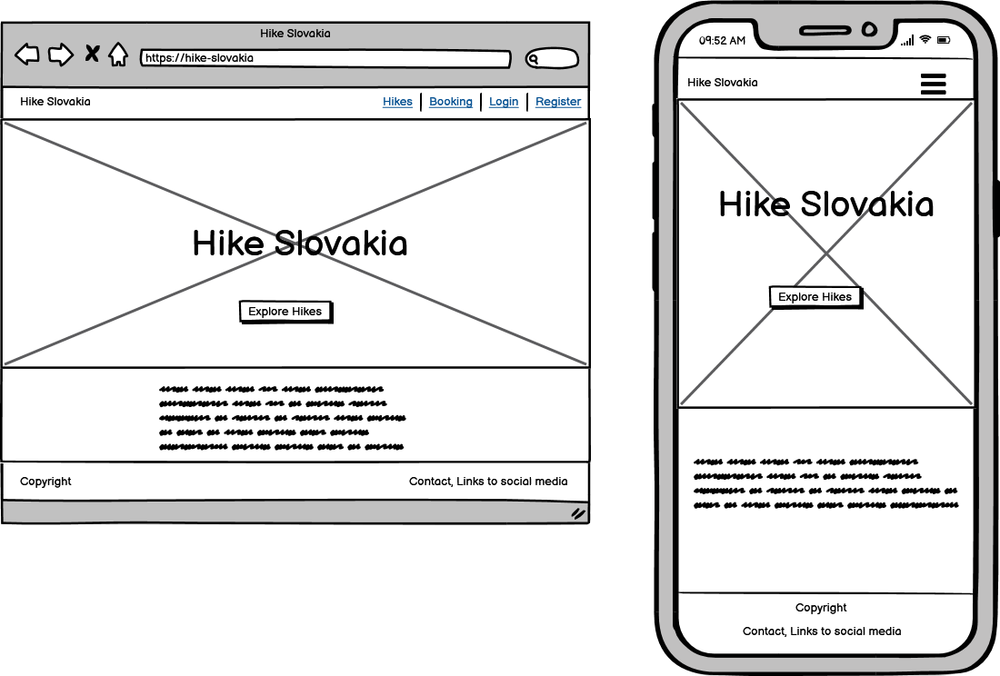

* Hike Offerings page
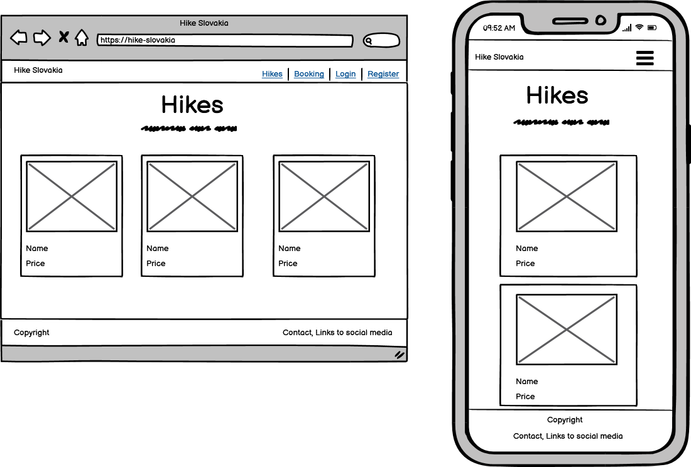

* Hike Detail page
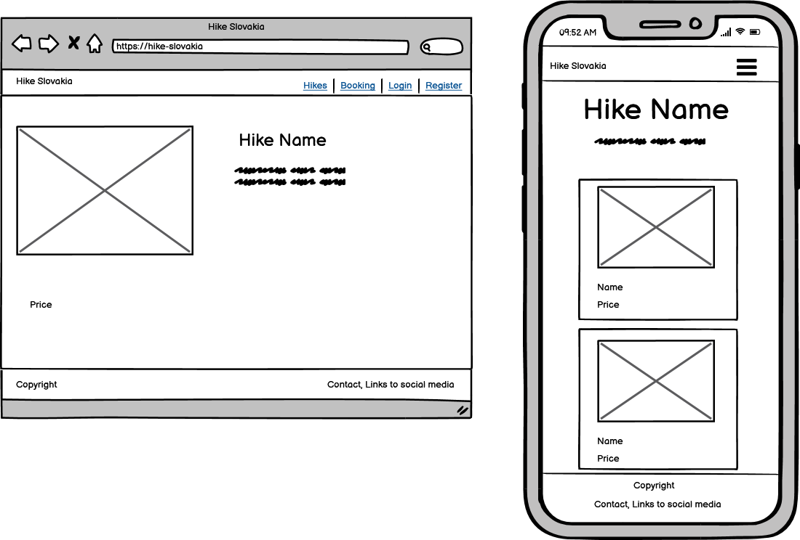

* Hike Detail page - logged in user only


* Hike Detail page - admin user only
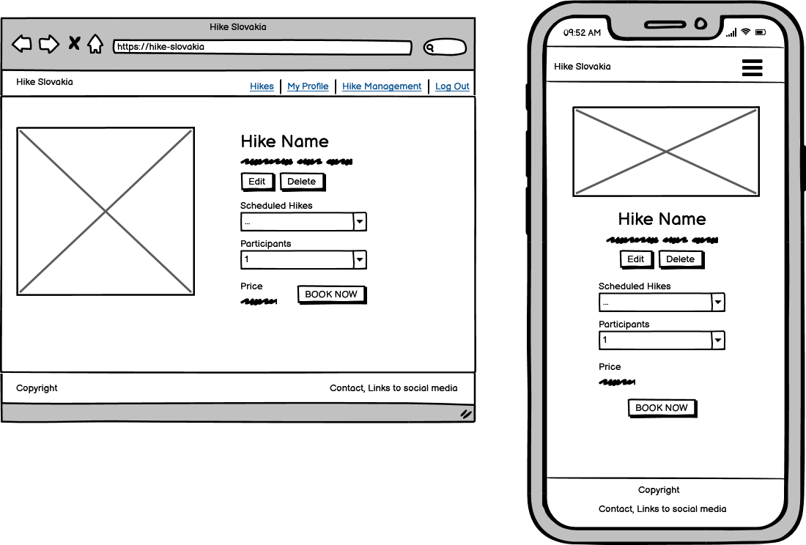

* Review Booking page - logged in user only
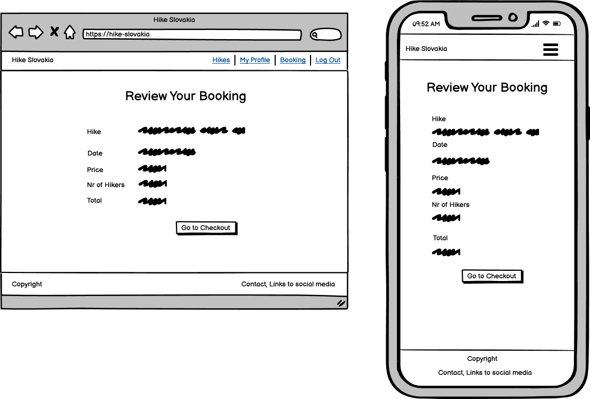

* Booking Confirmation page - logged in user only
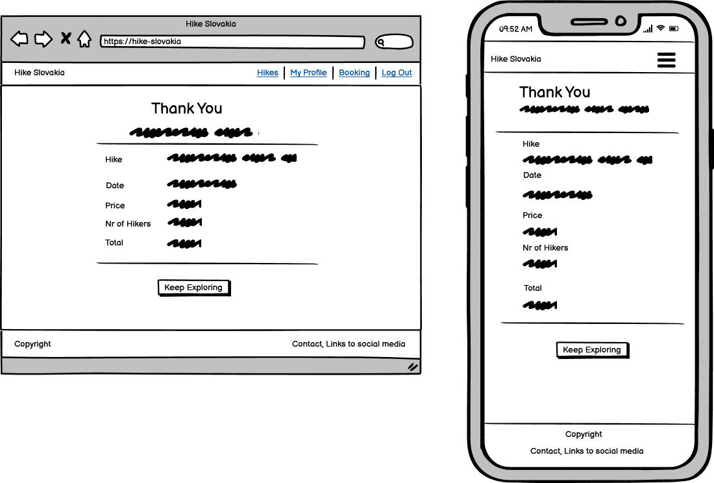

* Checkout page - logged in user only
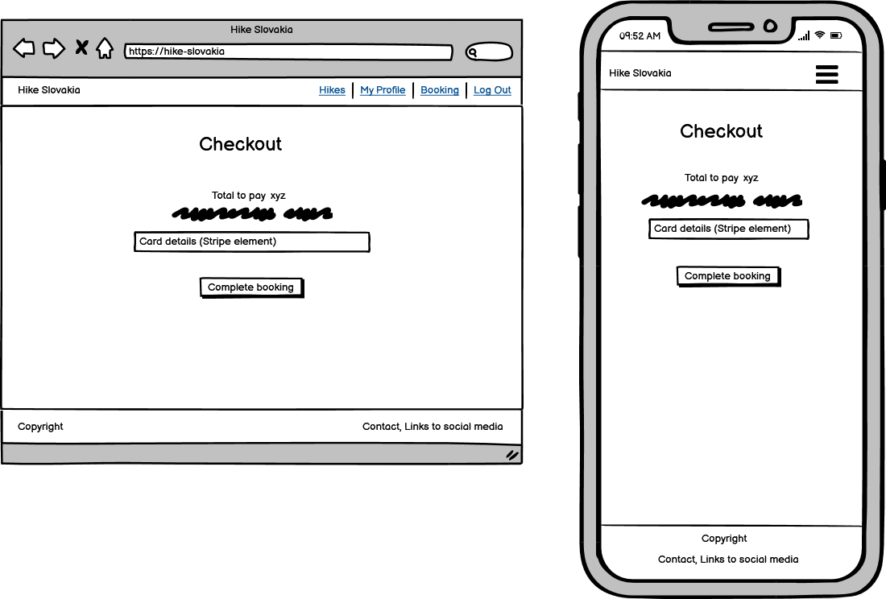

* Profile page
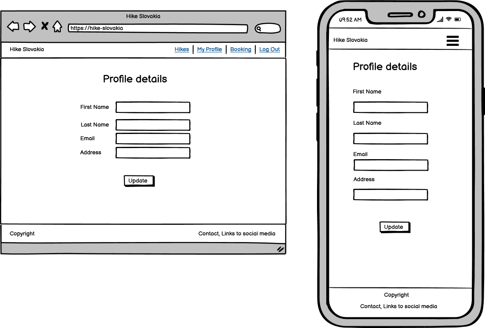

* Add a hike page - admin user only
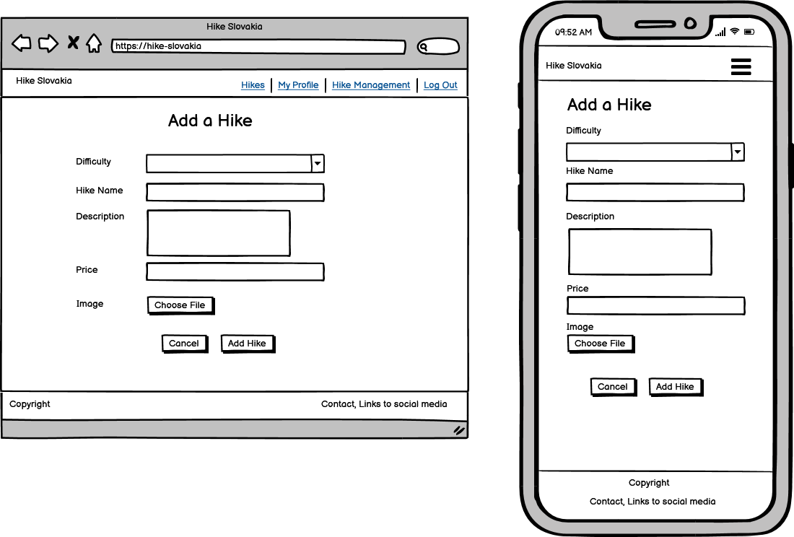

* Register page
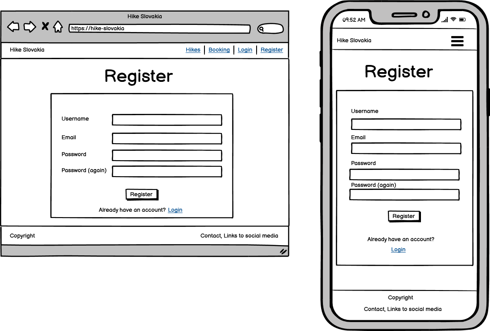

* Login page
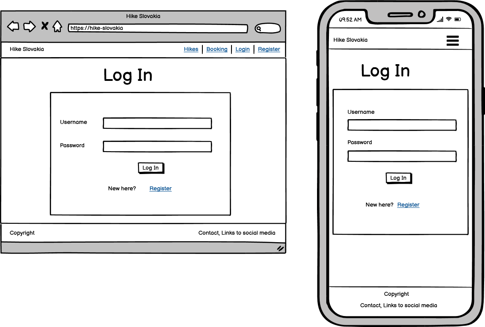

* 404 page


### Design

* #### Colour Scheme

* #### Typography

* #### Imagery

***
## Notes on Development Process

* I have decided to not follow the example e-commerce project Boutique Ado to the dot, and instead of selling products, I am selling services which are date-dependent. Boutique Ado being my introduction to Django, by not following its format, the learning curve has proven quite steep. Towards the end of the MVP development, I've started to feel like I am getting the grasp on Django, at long last! I can see many areas where I can improve the existing codebase and I am now quite excited to continue the development of this app, as well as other apps in the future.

* Trello Board has been used since the beginning of development to track progress, capture ideas, and make notes (screenshot from early on in the process)
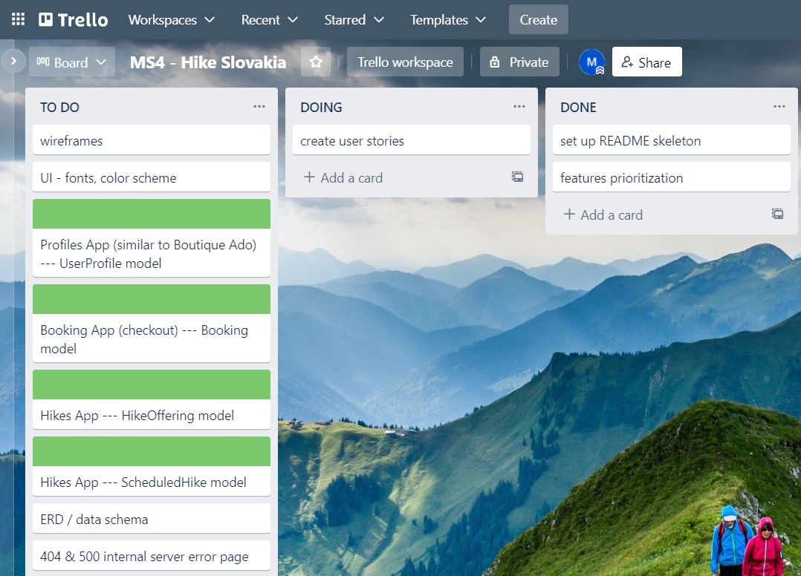

* Changes to design - layout of the website & pages was designed in advance, and wireframes were followed during development, except for some minor changes; the only major one being adding a list of past bookings to a user's profile page.

***
## Database Design


The above schema shows only the tables created by me (except the auth_user one, I am however manipulating its data in my code). 
Project Hike Slovakia currently contains 5 Django apps, and 5 custom models.

***
## Features

### Existing Features

### Features Left to Implement in the Future

***
## Technologies Used

### Languages Used

* HTML5
* CSS3
* JavaScript
* Python3

### Frameworks, Libraries & Programs Used

* [Django](https://www.djangoproject.com/) - open-source, Python-based web framework that follows the model–template–views architectural pattern
* Django AllAuth - to provide enhanced user account management functionality
* [Heroku](https://heroku.com/) - to deploy the live site
* Heroku PostgreSQL - to host the database
* [WhiteNoise](http://whitenoise.evans.io/en/stable/django.html) - mainly for serving static files
* [Cloudinary](https://cloudinary.com/) - to upload, store, manage, and deliver images
* [Bootstrap](https://getbootstrap.com/docs/4.6/getting-started/introduction/) - framework for building responsive, mobile-first sites
* [Font Awesome](https://fontawesome.com/) - to add icons to the site
* [pip](https://pip.pypa.io/en/stable/) - to install dependencies for the site
* [Git](https://git-scm.com/) - version control
* [GitHub](https://github.com/) - to store the code for this project
* [GitPod](https://www.gitpod.io/) - virtual IDE used to build this site
* [jQuery](https://jquery.com/) - JavaScript library
* [Google DevTools](https://developer.chrome.com/docs/devtools/) - invaluable during development
* [Trello](https://www.trello.com/) - to project manage, Kanban-style
* [Balsamiq](https://balsamiq.com/wireframes/) - to create wireframes
* [DbVisualizer](https://www.dbvis.com/) - to visualize database data
* [https://imagecompressor.com/](https://imagecompressor.com/) - to compress image files
* [https://favicon.io/](https://favicon.io/favicon-converter/) - to generate favicon
* [amiresponsive](https://ui.dev/amiresponsive?url=https://yoga-hub.herokuapp.com/home)

***
## Testing

### Validator Testing

### User Stories Testing

### Continuous Testing - Issues and Resolutions to issues found during testing

During the development process, the application was continuously tested and bugs and issues that were found were resolved. A few examples:

* When a user redirected to a checkout view manually (without selecting a hike to book first), a 500 internal server error was raised. This was happening due to the view initially incorrectly checking whether a local storage existed. (Which it did since we were initialising it there.) The bug was fixed by checking for existence of a hike_id in the local storage instead, and now if it does not exist, the user will be brought back to all_hikes view to select a hike to book.

* After implementing a confirmation email sending after a successful purchase, the checkout process started failing with 500 error. Logging details into console revealed a bug in code - customer's email was being populated with the user, rather than the user's email. The fix was rather straightforward and payment process works ok now. 

### Known Bugs and Issues

***
## Deployment

### Requirements for Deployment

* Heroku account
* Stripe account
* Cloudinary account
* GitHub account, Gitpod

### Heroku Deployment

This project was deployed on Heroku following these steps:

#### Requirements.txt and Procfile

Create these files using these steps in (GitPod) terminal:

1. Type `pip3 freeze -–local > requirements.txt` to create a requirements file (it keeps track of the Python / Django dependencies that we've installed for our project)
2. Type `echo web: python3 run.py > Procfile` to create Procfile (a Heroku-specific type of file that tells Heroku how to run our project, what command to use to start the app)
3. Delete any additional empty lines after the line `web: gunicorn hike_slovakia.wsgi:application`
4. Push these two files into your depository

#### Create Heroku App

1. Log in to Heroku and 'Create New App' from the dashboard
2. Choose an app name (each app name has to be unique)
3. Select the region based on your location
4. Click 'Create App'
5. Add config vars to Heroku - go to Heroku Settings tab, click on Reveal Config Vars, and add environment variables described below in key/value pairs

#### Create Database

1. Select the app from the list in Heroku
2. Go to Heroku 'Resources' tab and in the add-ons section search for Postgres
3. Select Heroku Postgres
4. Select 'Submit Order Form'
5. In the Heroku Settings tab, within the config vars section, the DATABASE_URL will appear and can be used to connect to the remote database
6. Migrations can be ran locally against the remote database if we set up the DATABASE_URL variable in our local environment.
7. In order to automate the process of migrating, we can add this line into Procfile (on line 1): `release: python manage.py makemigrations && python manage.py migrate`

#### Environment Variables

Create an env.py file within the Django app and configure the project via the following various environment variables.
(Please note - as this file contains sensitive information, it needs to be added to the .gitignore file to not be pushed to GitHub!)

It will look similar to this:

```
import os

os.environ["SECRET_KEY"] = "unique secret key"
os.environ["DEVELOPMENT"] = 'True'
os.environ["CLOUDINARY_URL"] = 'cloudinary_url'

```

Add these environment variables:

* SECRET_KEY - there are websites online that will help you generate random Django secret keys

* DEVELOPMENT - if set, it will put the project into debug mode

* EMAIL_HOST_USER - your email address used to send emails out

* EMAIL_HOST_PASS - used to authenticate to the SMTP server

* STRIPE_PUBLIC_KEY, STRIPE_SECRET_KEY, STRIPE_WH_SECRET - Stripe payments variables (you will need to set up a Stripe account)

* CLOUDINARY_URL - to upload images to Cloudinary (you will need to set up a Cloudinary account)

Add these variables to Heroku's Config Vars as well (do not add the DEVELOPMENT one, so that Heroku runs in production mode)

#### Deploying our App to Heroku

1. Navigate to the Deploy tab in Heroku and connect your app to GitHub.
2. Deploy the branch manually.
3. Check the build log for errors.
4. Once Heroku completed the build process, you will see a 'Your App Was Successfully Deployed' message and a link to the live site.
5. You can also choose to enable Automatic deploys. 

#### Alternative Heroku deployment via CLI

0. In your CLI install Heroku by typing `npm install -g heroku`
1. Login to Heroku by typing `heroku login -i`
2. Get your app name from Heroku by typing command `heroku apps`
3. Set the Heroku remote (replace the <app_name> with your actual app name): `heroku git:remote -a <app_name>`
4. Add and commit changes to your code (commands `git add .` & `git commit -m "Deploy to Heroku via CLI"`)
5. Push to GitHub `git push origin main`
6. Push to Heroku `git push heroku main`
7. Your Heroku app will be built and you will see your deployed app's URL

### Forking the Repository

This project can be forked following these steps: 

1. Log in to GitHub and locate this project (you are most likely here). 
2. Locate the Fork button at the top right corner of the page and click on it. 
3. A copy of the original repository is now in your GitHub account

### Local Clone

1. Navigate to this GitHub repository (you are most likely here)
2. Click on the Code dropdown
3. Copy the URL of the repository in the HTTPS tab
4. Use your IDE of choice to open its terminal
5. Change the current working directory to the location where you want the cloned directory
6. Type `git clone` and then paste the previously copied URL
7. Press enter to create your local clone
8. Create the above described env.py file with your own values
9. Install the project requirements by using the command `pip3 install -r requirements.txt`
10. Run the program

***
## Credits

### Code

* project is based on and developed from [Code Institute](https://codeinstitute.net/)'s walkthrough Boutique Ado
* Django documentation has been researched extensively
* code for modal from [W3Schools](https://www.w3schools.com/howto/howto_css_modals.asp)
* gte lookup for filtering by future date on [Stack Overflow](https://stackoverflow.com/questions/45947222/django-queryset-with-datetime-need-to-get-all-future-dated-entries)

### Media

* background immage on home page from [Pixabay](https://pixabay.com/)
* default hike image from [Pxhere](https://pxhere.com/)
* all other images of Slovak nature currently used on hikes' pages were taken by Monika Hrda
* gif image used as a loading "spinner" found on [Icons8](https://icons8.com/preloaders/)

### Acknowledgements

A big thank you to fellow Slackers from Code Institute's Slack channel for their support, advice, encouragement, and friendship.