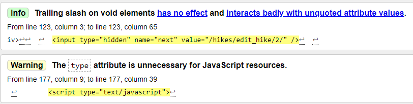
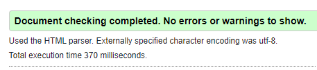
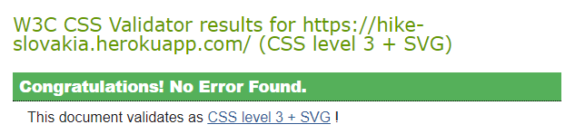

Go back to [README.md](https://github.com/monika-hrda/hike-slovakia/blob/main/README.md)

## Testing

* Validator Testing
* Stripe Testing
* Page quality measurement / Performance
* User Stories Testing
* Manual Testing
* Error Testing
* Continuous Testing

### Validator Testing

#### HTML

All pages were checked using [W3C Markup Validation Service](https://validator.w3.org/).

The HTML code was validated using the page URI.

There was one warning and two info messages found, which have been corrected. See below.

All pages are passing all checks.

#### CSS

The CSS file was checked using [W3C CSS Markup Validation Service](https://jigsaw.w3.org/css-validator/).

It was tested both via URI and direct input. No errors were found.

#### JavaScript

[JSHint](https://jshint.com/) was used to validate JavaScript code. 

"One undefined variable" was raised for 'Stripe', which now got corrected to 'stripe'. Also, 3 semicolons were found to be missing :)

However, changing 'Stripe' to 'stripe' broke Stripe's functionality, so it's been changed back to its original state.

The project's JavaScript code is now passing this validator.

#### Python

The [PEP8 online](http://pep8online.com/) validator website is currently not functional, so the Python code was checked by a PEP8 validator directly in my Gitpod Workspace. 

All errors (mostly 'Line too long') have been corrected, except the usual issue with Django adding the `objects`, `DoesNotExist` properties to all model classes, which the IDE is not aware of (e.g. `Class 'xyz' has no 'objects' member` and `Class 'zyx' has no 'DoesNotExist' member`). These are just warnings from pylint.
Same goes for `Instance of 'OneToOneField' has no 'username' member`. 

All classes have been given docstrings.

### Stripe Testing

* The following Stripe test card numbers were used to test Stripe webhooks and the payment process:
  * 4242 4242 4242 4242 - successful payment
  * 4000 0025 0000 3155 - requires authentication for every payment
  * 4000 0000 0000 9995 - card declined
  * set expiry date to any future date
  * more information on [Stripe website](https://stripe.com/docs/testing)
* Stripe payments are working as expected.
* After a successful payment, user is redirected to the Checkout Success page.

### Page quality measurement by [web.dev](https://web.dev/measure/)

I was overall happy with these results. Heroku delivery is causing the biggest delay on page load, but the next suggested opportunity was to "Consider delivering critical JS/CSS inline and deferring all non-critical JS/styles."

While I am not happy with the performance score of 63, in the report I can see the areas I can make improvements in. A lot of it is due to the app being deployed on Heroku, which introduces a lag, but I can improve speed for example by moving JS code to external files. 
I am very happy with the other metrics - Accessibility, Best Practices, and SEO.

### User Stories Testing

As a guest / not logged in user, I want to be able to:
* easily understand what the purpose of the website is.
  * Background image of nature in Slovakia.
  * Button inviting users to explore.
* navigate the website easily, so that I can find any relevant content.
  * Navigation links working perfectly.
* find more information about the company, so that I can understand more about what they are doing.
  * Links to social media of the company in the footer.
* view an offering of all guided hikes posted on the website.
  * All hikes page shows all hikes.
* find general details of any guided hike, as well as find out what dates they are scheduled on.
  * Detail page shows all the details to both logged in and not logged in users.
* contact the business owner / administrator, so that I can ask any specific questions and get more information.
  * Contact form present on app.
* view the website clearly on multiple devices, including my mobile device, so that I can achieve my other goals on the go.
  * Accessibility tested.
* register on the website so that I can book / pay for a hike I am interested in.
  * Register function.

As a registered / logged in user, in addition to the above, I want to be able to:
* log into my account so that I can use the website’s services.
  * Log in function works.
* select the number of people I am booking a selected hike for.
  * Selection of hike details avaialble on the hike detail page. Only future dates show.
* start the booking process of the scheduled hike I am interested in.
  * By clicking on the Book Now button.
* securely pay for the scheduled hike I choose to book.
  * Stripe functionality works perfectly.
* receive a confirmation email after I successfully book my hike.
  * Confirmation emails send.
* view my profile - including my personal information as well as a list of hike bookings I made in the past.
  * Profile page with all information and past bookings accessible on Profile page link.
* update my personal information.
  * Update function available on Profile page.
* log out.
  * Log out function works.

As an admin, I want to be able to:
* add a new hike offering, so that I can expand my services offering.
  * Add New Hike link and page available to admin.
* update and delete any existing hike offering, so that I can stay flexible in my offerings in accordance with my business needs.
  * Edit and Delete buttons available on Hike Detail page.
* schedule a new hike.
  * Functionality available from admin part of the website.
* access the Django admin portal easily.

### Manual Testing

---
### **Home Page**
| Element               | Action            | Expected Result           | Pass/Fail  |
|:-------------         |:-------------     |:-----                     |:-----|
| **Home page**         |                   |                           |    |
|Heading to Home        |  Click Heading    | Returns to Home Page      |Pass|
|Explore Hikes Button   |  Click Button     | Opens Hike List Page      |Pass|

---

### **Navigation incl. Footer**
| Element               | Action            | Expected Result           | Pass/Fail  |
|:-------------         |:-------------     |:-----                     |:-----|
| **Navigation**        |                   |                           |    |
|Hikes link             |  Click Link       | Opens Hike List Page      |Pass|
|Profile Link           |  Click Link       | Opens Profile Page        |Pass|
|Log in Link            |  Click Link       | Opens Log in Page         |Pass|
|Log out Link           |  Click Link       | Renders Log out prompt    |Pass|
|Register Link          |  Click Link       | Opens Log in Page         |Pass|
|Add New Hike Link      |  Click Link       | Opens Add New Hike Page |Pass|
|Contact Us Link        |  Click Link       | Opens Contact Page |Pass|
|Facebook Footer icon   |  Click Link       | Opens new Facebook tab in browser |Pass|
|Instagram Footer icon  |  Click Link       | Opens new Instagram tab in browser |Pass|
|Youtube Footer icon    |  Click Link       | Opens new Youtube tab in browser |Pass|

---

### **Sign up**
| Element               | Action            | Expected Result           | Pass/Fail  |
|:-------------         |:-------------     |:-----                     |:-----|
| **Sign up**           |                   |                           |    |
|Form                   |  Submit empty form  | Expect prompt to fill in missing or incorrect fields  |Pass|
|Form                   |  Submit complete entry form  | Returns to home page with success message      |Pass|
|Back to Log in Button  |  Click button       | Returns to Login     |Pass|
|Sign in Link   |  Click Link       | Opens Sign in Page             |Pass|
|Email Confirmation    |  Create account and wait for email verification  | Returns email with link to finish account setup  |Pass|

---

### **Sign in**
| Element               | Action            | Expected Result           | Pass/Fail  |
|:-------------         |:-------------     |:-----                     |:-----|
| **Sign in**           |                   |                           |    |
|Form          |  Submit Empty form           |  Expect prompt to fill in missing or incorrect fields   |Pass|
|Form          |  Submit Complete form           | Returns to home page with success message             |Pass|
|Remember Me   |  Click checkbox      | Remembers user next time they visit the site      |Pass|
|Home Button   |  Click Button       | Returns to Home page                 |Pass|

---
### **Forget Password**
| Element               | Action            | Expected Result           | Pass/Fail  |
|:-------------         |:-------------     |:-----                     |:-----|
| **Forget Password**   |                   |                           |    |
|Form                 |  Submit Empty form           |  Expect prompt to fill in missing or incorrect fields    |Pass|
|Form                 |  Submit Complete form          |  Displays prompt to say an email has been sent   |Pass|
|Back to Login button  |  Click button           | Return to Login Page          |Pass|

---
### **Log out**
| Element               | Action            | Expected Result           | Pass/Fail  |
|:-------------         |:-------------     |:-----                     |:-----|
| **Log out**           |                   |                           |    |
|Log out link           |  Click link       | Render page with sign out button   |Pass|
|Sign out button        |  Click button     | Logs user out and returns to home page  |Pass|

---

### **Profile page**
| Element               | Action            | Expected Result           | Pass/Fail  |
|:-------------         |:-------------     |:-----                     |:-----|
| **Profile Page**      |                   |                           |    |
|Edit First Name        |  Add First name and save | New imformation is saved, with confirmation message above |Pass|
|Edit Last Name         |  Add Last name and save  | New imformation is saved, with confirmation message above |Pass|
|Edit Email Address     |  Update email and save   | If email is valid, it is saved with confirmation message above |Pass|
|Edit Phone Number      |  Add Phone number and save | If a valid phone number, it is saved with confirmation message above |Pass|
|Booking History        | Make booking and check history | Latest booking will show with booking number and info|Pass|

---

### **Hikes List**
| Element               | Action            | Expected Result           | Pass/Fail  |
|:-------------         |:-------------     |:-----                     |:-----|
| **Hikes**             |                   |                           |    |
|Hikes List             |  View Hikes Page  | Hike List shows cards with hike images and info in them   |Pass|
|Hikes List addtions    |  Add Hike and check Hikes list page after | Hike should be visible automatically    |Pass|
|Hike Cards             |  Click on Hike Card  | Will take you to the specific Hike detail page of the card clicked on |Pass|

---

### **Hike Detail**
| Element               | Action            | Expected Result           | Pass/Fail  |
|:-------------         |:-------------     |:-----                     |:-----|
| **Hike Detail**       |                   |                           |    |
|Hike Data      |  Create a new hike as admin and check info is all there  | All information management form is present |Pass|
|Select date    |  Click on dropdown  | Can select a date from the dropdown  |Pass|
|Select number of people  |  Click on dropdown  | Can select number of hikers from the dropdown  |Pass|
|Submit empty form |  Try to submit empty form booking  | Form will not submit and user reminded to fill in required fields  |Pass|
|Submit partially complete form |  Try to submit with only one option selected  | Form will not submit and user reminded to fill in required field |Pass|
|Submit book hike  |  Click the book a hike button  | Redirected to booking confirmation page |Pass|
|Edit booking button |  Click Edit booking button  | Return back to the hike detail page  |Pass|
|Go to checkout button |  Click go to checkout button | Go to Checkout to make payment |Pass|
|Edit Hike (ADMIN ONLY)    |  Click button  | Taken to hike management to edit hike   |Pass|
|Delete Hike (ADMIN ONLY)    |  Click button | Removes hike from Hike list  |Pass|

---

### **Checkout**
 | Element               | Action            | Expected Result           | Pass/Fail  |
|:-------------         |:-------------     |:-----                     |:-----|
| Checkout   | Make Payment through Stripe  |  Payment goes through, with booking info below and confirmation message above |Pass|
| Email Confirmation | Make booking and wait for email confirmation  | Email will arrive with receipt of booking info  |Pass|
|Keep Exploring with us button | Click button  | Return to hikes list page |Pass|

---

### **Add Hike Page (Admin only)**
| Element               | Action            | Expected Result           | Pass/Fail  |
|:-------------         |:-------------     |:-----                     |:-----|
| **Hike Management**   |                   |                           |    |
|Submit empty form  | Try to submit empty form | Form won't send, points to first required field not filled in |Pass|
|Submit partially complete form  |  Try to submit partially complete form | Form won't send, points to first required field not filled in  |Pass|
|Submit Complete form for new Hike |  Add new hike by clicking add Hike button | Hike adds and redirects to new hike detail page |Pass|
|Image Upload  |  Upload image | Image should upload successfully |Pass|

---

### **Contact Page**
| Element               | Action            | Expected Result           | Pass/Fail  |
|:-------------         |:-------------     |:-----                     |:-----|
| **Contact Page**       |                   |                           |    |
|Form submission                 |  Submit Empty form | Form will not send and points to first required field not filled in |Pass|
|Form submission                 |  Submit partially complete form | Form will not send and points to first required field not filled in |Pass|
|Form submission                 |  Submit complete form | Form sends and confirmation message appears above |Pass|

---

### Error Testing

Tested 404, 403 and 500 Error Pages show. 404 Error Page can be accessed by typing any non-existing link to browser, e.g. [404 Error](https://hike-slovakia.herokuapp.com/no-no-no)

### Continuous Testing - Issues and Resolutions to issues found during testing

During the development process, the application was continuously tested and bugs and issues that were found were resolved. A few examples:

* When a user redirected to a checkout view manually (without selecting a hike to book first), a 500 internal server error was raised. This was happening due to the view initially incorrectly checking whether a local storage existed. (Which it did since we were initialising it there.) The bug was fixed by checking for existence of a hike_id in the local storage instead, and now if it does not exist, the user will be brought back to all_hikes view to select a hike to book.

* After implementing a confirmation email sending after a successful purchase, the checkout process started failing with 500 error. Logging details into console revealed a bug in code - customer's email was being populated with the user, rather than the user's email. The fix was rather straightforward and payment process works ok now. 

### Known Bugs and Issues
